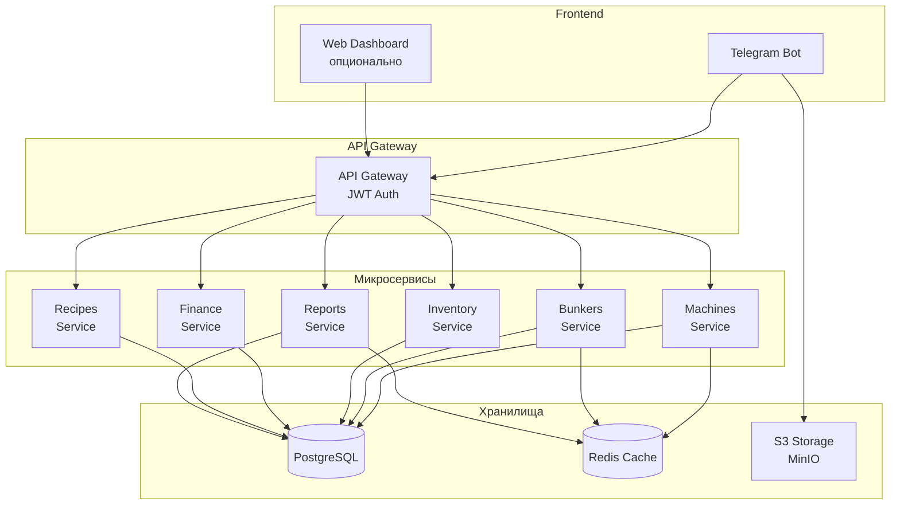
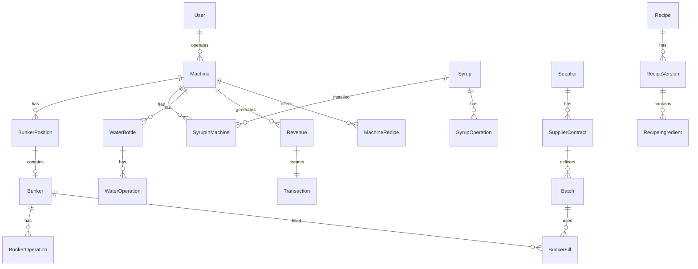
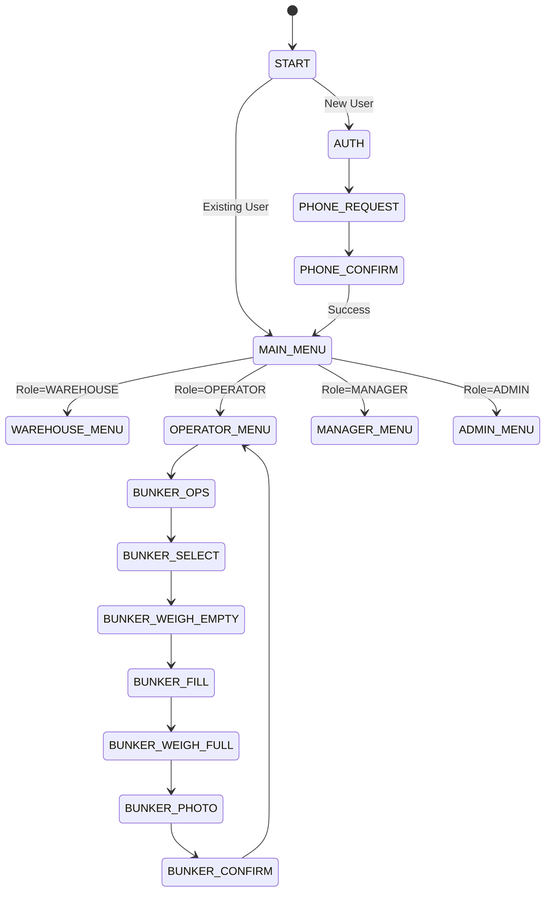
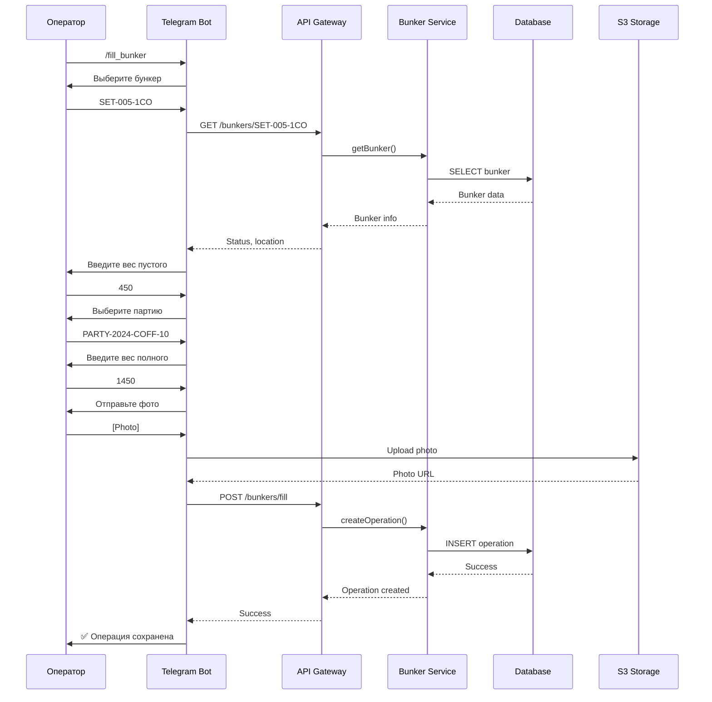
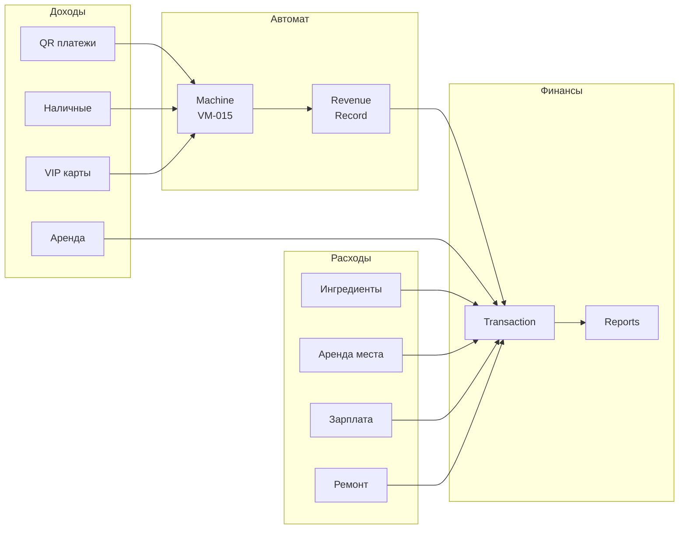
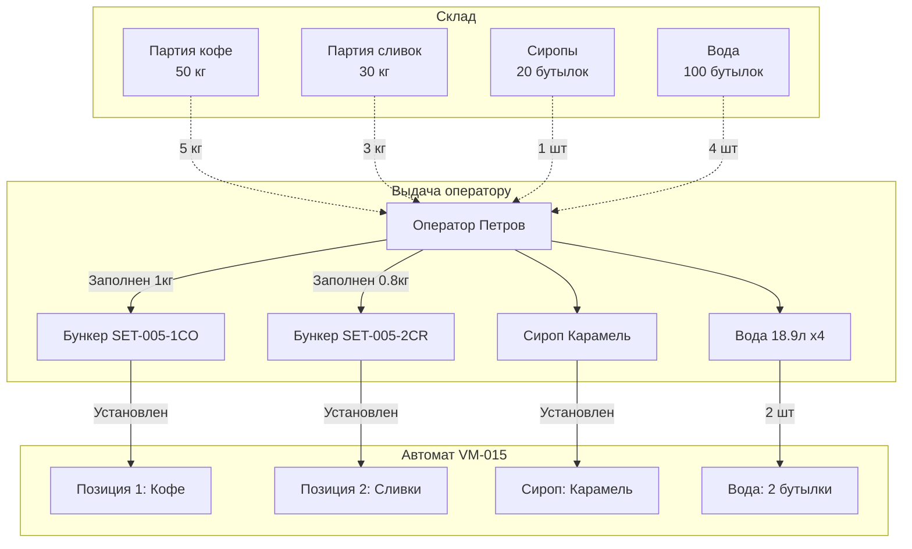
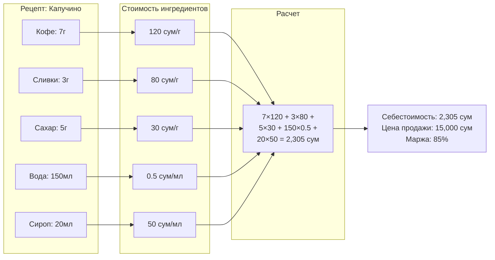
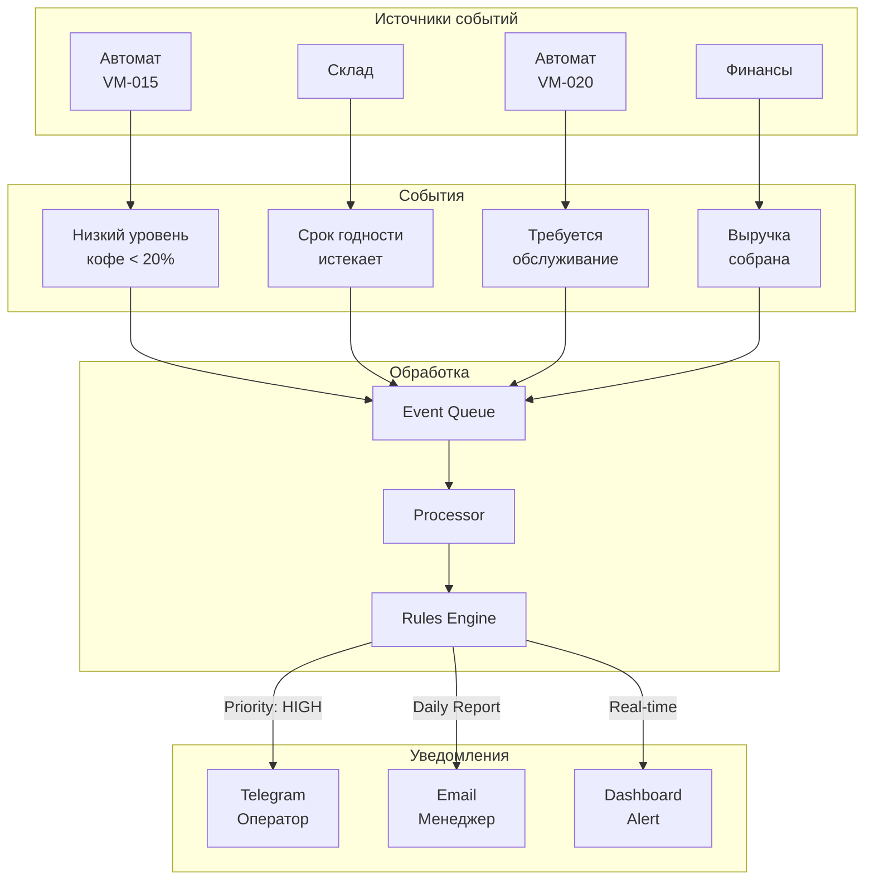
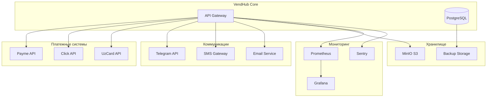

# VendHub - Диаграммы архитектуры

## 1. Общая архитектура системы



## 2. Структура базы данных (основные связи)



## 3. Telegram Bot FSM Flow



## 4. Процесс заполнения бункера



## 5. Финансовый поток



## 6. Учет компонентов



## 7. Расчет себестоимости



## 8. Мониторинг и уведомления



## 9. Интеграции



## 10. Deployment Architecture

```mermaid
graph TB
    subgraph "Load Balancer"
        LB[Nginx/HAProxy]
    end
    
    subgraph "Kubernetes Cluster"
        subgraph "Services"
            POD1[API Gateway<br/>3 replicas]
            POD2[Machines Service<br/>2 replicas]
            POD3[Bunkers Service<br/>2 replicas]
            POD4[Telegram Bot<br/>1 replica]
        end
        
        subgraph "Data Layer"
            PG[PostgreSQL<br/>Primary]
            PGR[PostgreSQL<br/>Read Replica]
            REDIS[Redis Cluster]
        end
        
        subgraph "Storage"
            PV[Persistent<br/>Volumes]
            S3[MinIO]
        end
    end
    
    subgraph "External"
        CDN[CDN for media]
        MON[Monitoring]
    end
    
    LB --> POD1
    POD1 --> POD2
    POD1 --> POD3
    
    POD2 --> PG
    POD2 --> PGR
    POD3 --> PG
    POD3 --> REDIS
    
    POD4 --> POD1
    S3 --> CDN
    
    PG --> PV
    S3 --> PV
